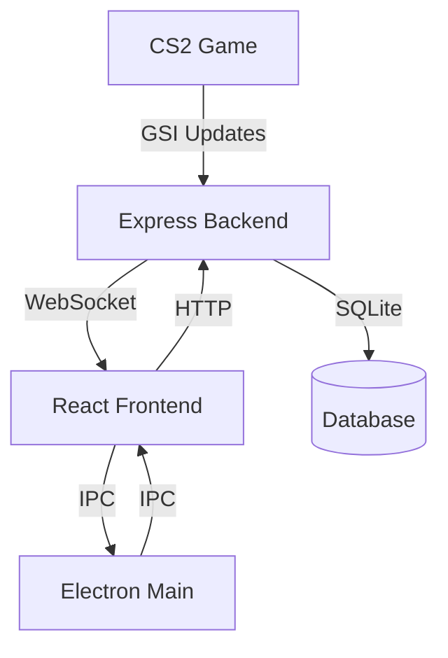

# Architecture Overview

OpenHud is built as a monorepo using Electron, React, and Node.js. This document provides a high-level overview of the project's architecture and how different components interact.

## Project Structure

```
OpenHud/
├── src/
│   ├── UI/               # React frontend code
│   │   ├── components/   # Reusable React components
│   │   ├── pages/       # Page components
│   │   ├── context/     # React context providers
│   │   ├── hooks/       # Custom React hooks
│   │   └── api/         # API client code
│   ├── electron/        # Electron main process code
│   │   ├── server/      # Express.js backend server
│   │   ├── database/    # SQLite database layer
│   │   └── ipcEvents/   # IPC event handlers
│   └── assets/          # Static assets and configs
└── docs/                # Documentation
```

## Core Components

### 1. Electron Main Process

The Electron main process (`src/electron/main.ts`) is responsible for:
- Creating and managing application windows
- Handling IPC communication
- Managing the system tray
- Starting the Express.js server

### 2. Express.js Backend

The backend server (`src/electron/server/server.ts`) provides:
- REST API endpoints for data access
- Game State Integration (GSI) listener
- WebSocket server for real-time updates
- SQLite database integration

### 3. React Frontend

The React application (`src/UI/`) includes:
- Main application interface
- In-game overlays
- Performance dashboard
- Settings management

### 4. Game State Integration (GSI)

The GSI system consists of:
- CS2 configuration file for sending game state
- WebSocket server for receiving updates
- Data processing and analysis layer
- Real-time overlay updates

## Communication Flow



### IPC Communication

Inter-Process Communication (IPC) is used for:
- Window management (show/hide overlays)
- Screenshot/clip capture
- System-level operations

### WebSocket Communication

WebSocket connections handle:
- Real-time game state updates
- Overlay notifications
- Live performance metrics

### Database Layer

SQLite is used to store:
- Player profiles and statistics
- Match history
- AI coaching data
- Application settings

## AI Components

The AI system includes several specialized tools:

### 1. Core AI Tooling
- Tool management framework
- Execution orchestration
- Error handling and monitoring

### 2. Analysis Tools
- Position analysis
- Economy suggestions
- Performance tracking

### 3. Memory System
- Short-term match memory
- Long-term player profiles
- Learning and adaptation

## Overlays

OpenHud implements several overlay windows:

### 1. HUD Overlay
- Player status
- Agent feedback
- Task progress

### 2. Media Player Overlay
- Screenshot display
- Clip playback
- Navigation controls

### 3. Task Overlay
- Current objectives
- Progress tracking
- Reward status

## Performance Dashboard

The web-based dashboard provides:
- Player statistics
- Match history
- Performance analysis
- Settings configuration

## Security Considerations

The application implements several security measures:
- Secure IPC communication
- CSP for overlays
- SQLite query sanitization
- Input validation

## Development Workflow

For development:
1. Start the Electron main process
2. Launch the Express.js server
3. Run the React development server
4. Configure CS2 for GSI

## Further Reading

- [API Reference](./api-reference.md)
- [User Guide](./user-guide.md)
- [Contributing Guide](./contributing.md) 