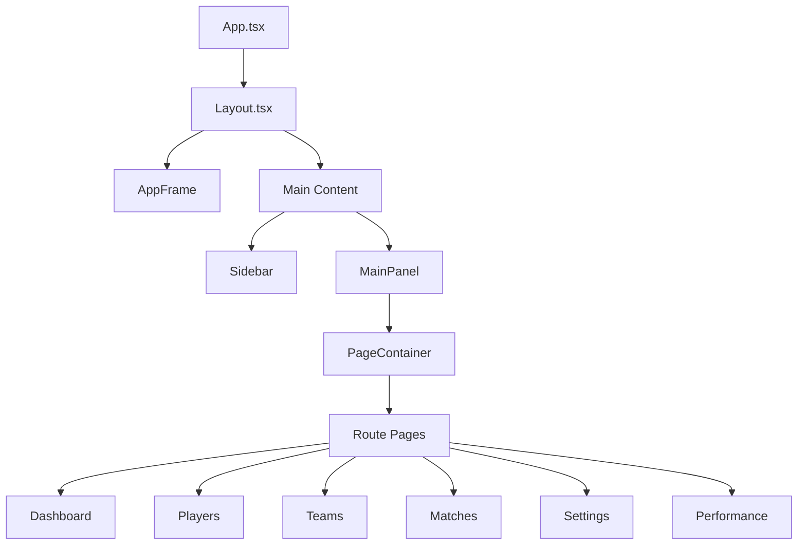
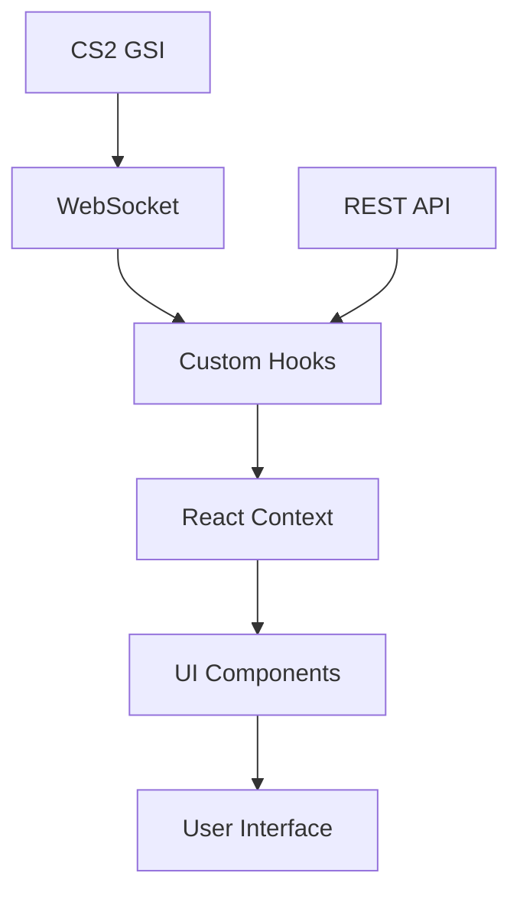

# React Components Architecture

This document details the architecture of OpenHud's React components, including the component hierarchy, state management, and data flow.

## Component Hierarchy



### Core Layout Components

#### Layout (`Layout.tsx`)
The root layout component that structures the application:
```typescript
export const Layout = () => {
  const { theme } = useThemes();
  return (
    <div className={`${theme} flex h-screen w-screen flex-col`}>
      <AppFrame />
      <div className="flex flex-1 overflow-hidden">
        <Sidebar />
        <div className="flex flex-1 flex-col">
          <MainPanel />
        </div>
      </div>
    </div>
  );
};
```

#### MainPanel (`MainPanel.tsx`)
The main content area that renders route-based pages:
```typescript
export const MainPanel = () => {
  return (
    <main className="flex-1 overflow-y-auto">
      <PageContainer />
    </main>
  );
};
```

#### Sidebar (`Sidebar.tsx`)
Navigation sidebar with collapsible behavior:
```typescript
export const Sidebar = () => {
  const { isOpen } = useDrawer();
  return (
    <section className={`relative flex flex-col ${isOpen ? "w-52" : "w-20"}`}>
      <MenuToggle />
      <RouteSelect />
      <AccountToggle />
    </section>
  );
};
```

## State Management

OpenHud uses React Context for global state management, with custom hooks for domain-specific state:

### Context Providers

```typescript
export const AppProviders: React.FC = ({ children }) => {
  return (
    <ThemesProvider>
      <MatchesProvider>
        <PlayersProvider>
          <DrawerProvider>
            <TeamsProvider>
              {children}
            </TeamsProvider>
          </DrawerProvider>
        </PlayersProvider>
      </MatchesProvider>
    </ThemesProvider>
  );
};
```

### Domain Contexts

#### PlayersContext
Manages player profiles and statistics:
- Player CRUD operations
- Performance tracking
- Settings preferences

#### TeamsContext
Handles team-related state:
- Team composition
- Team statistics
- Match history

#### MatchesContext
Controls match state and history:
- Current match data
- Historical matches
- Match analysis

#### ThemesContext
Manages application theming:
- Theme selection
- Color schemes
- UI preferences

#### DrawerContext
Controls UI element visibility:
- Sidebar state
- Modal states
- Overlay visibility

## Custom Hooks

### Data Hooks

#### `usePlayers`
Player data operations:
```typescript
const { 
  players,
  addPlayer,
  updatePlayer,
  deletePlayer,
  getPlayerStats
} = usePlayers();
```

#### `useTeams`
Team management:
```typescript
const {
  teams,
  createTeam,
  updateTeam,
  deleteTeam,
  getTeamStats
} = useTeams();
```

#### `useMatches`
Match handling:
```typescript
const {
  matches,
  currentMatch,
  startMatch,
  endMatch,
  updateMatchStats
} = useMatches();
```

### UI Hooks

#### `useDrawer`
Drawer/sidebar state:
```typescript
const {
  isOpen,
  toggle,
  open,
  close
} = useDrawer();
```

#### `useThemes`
Theme management:
```typescript
const {
  theme,
  setTheme,
  toggleTheme
} = useThemes();
```

#### `useAgentSocket`
WebSocket connection for real-time updates:
```typescript
const {
  connected,
  messages,
  sendMessage
} = useAgentSocket();
```

#### `usePerformance`
Performance metrics and analysis:
```typescript
const {
  stats,
  trends,
  analyze
} = usePerformance();
```

## Overlay Components

### HUD Overlay
In-game heads-up display:
```typescript
interface HUDProps {
  position: 'top' | 'bottom';
  opacity: number;
  showStats: boolean;
}
```

### Media Player Overlay
Screenshot and clip viewer:
```typescript
interface MediaPlayerProps {
  type: 'screenshot' | 'video';
  path: string;
  autoHide?: boolean;
  duration?: number;
}
```

### Task Overlay
Task and objective display:
```typescript
interface TaskOverlayProps {
  task: Task;
  progress: number;
  rewards?: Reward[];
}
```

## Data Flow



1. Game state updates flow from CS2 via WebSocket
2. Custom hooks process and normalize data
3. Context providers distribute state
4. Components render updated UI

## Component Communication

### Parent-Child Props
Standard React props for direct communication:
```typescript
interface ChildProps {
  data: any;
  onAction: (data: any) => void;
}
```

### Context Communication
Global state updates via context:
```typescript
const { dispatch } = useContext(AppContext);
dispatch({ type: 'UPDATE_STATE', payload: data });
```

### Event Communication
WebSocket events for real-time updates:
```typescript
socket.on('gsi:update', (data) => {
  updateGameState(data);
});
```

## Styling

OpenHud uses Tailwind CSS for styling:

### Theme System
```typescript
interface Theme {
  background: {
    primary: string;
    secondary: string;
  };
  text: {
    primary: string;
    secondary: string;
  };
  accent: {
    primary: string;
    secondary: string;
  };
}
```

### Layout Classes
Common layout utilities:
```css
.flex-container {
  @apply flex flex-col h-full;
}

.overlay {
  @apply fixed inset-0 bg-black/50 backdrop-blur-sm;
}

.card {
  @apply bg-background-primary rounded-lg shadow-md;
}
```

## Performance Optimization

### Code Splitting
Route-based code splitting:
```typescript
const Dashboard = lazy(() => import('./pages/Dashboard'));
const Performance = lazy(() => import('./pages/Performance'));
```

### Memoization
Component and callback memoization:
```typescript
const MemoizedComponent = memo(Component);
const memoizedCallback = useCallback(() => {}, []);
```

### State Updates
Batched state updates:
```typescript
const updateState = () => {
  batch(() => {
    setStateA(newA);
    setStateB(newB);
  });
};
```

## Testing Strategy

### Component Testing
Using React Testing Library:
```typescript
test('renders component', () => {
  render(<Component />);
  expect(screen.getByText('Title')).toBeInTheDocument();
});
```

### Hook Testing
Custom hook testing:
```typescript
test('hook behavior', () => {
  const { result } = renderHook(() => useCustomHook());
  act(() => {
    result.current.update();
  });
  expect(result.current.value).toBe(expected);
});
```

### Integration Testing
End-to-end testing with Playwright:
```typescript
test('user flow', async ({ page }) => {
  await page.goto('/');
  await page.click('button');
  await expect(page.locator('.result')).toBeVisible();
});
```

## Best Practices

### Component Organization
- One component per file
- Clear component responsibilities
- Consistent naming conventions
- Proper prop typing

### State Management
- Minimize global state
- Use local state when possible
- Clear update patterns
- Proper error handling

### Performance
- Implement virtualization for long lists
- Lazy load routes and components
- Optimize re-renders
- Monitor bundle size

### Accessibility
- Proper ARIA attributes
- Keyboard navigation
- Color contrast
- Screen reader support 